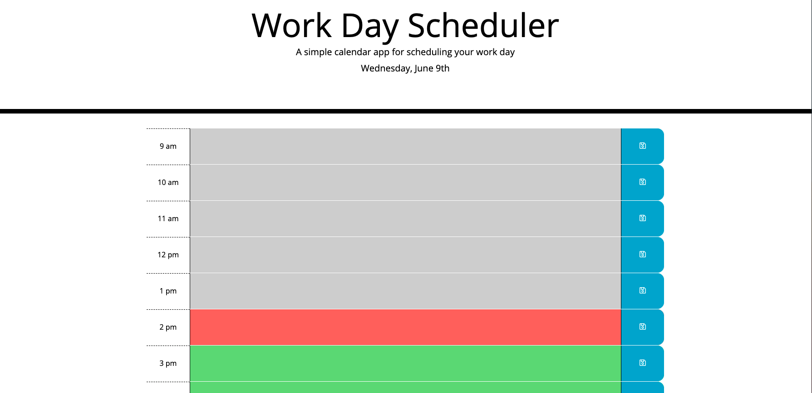

# Work-Day-Scheduler

## Description
This project was a homework dessigned for the ITESM Bootcamp, in which we were supossed to develop and Work-Day-Scheduler using JQuery, moment.js and local storage. 

## Installation
This project has been deployed to GitHub. To get this project up and running, you can follow the deployment link.

https://eduadomtz.github.io/Work-Day-Scheduler/

## Usage
The project aims to represent a calendar workday in wich the day is shown in hour time blocks, showing differente colos if the present hour, past or future.

It also must save in local storage when an input is save and the show it eventhough you refresh the page.

## Features

HTML PAGE
    Bootstrap
    Fontawesome
    Google fonts
    Jquery

CSS Page

Javascrip page